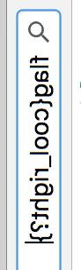

## Soltuion

For this challenge there is not much to think about.
The statement explains clearly what we have to do. 
Trouble on this is that we have to implement it.

My initial ideal was to load the image and get the first 
304 pixels and insert them as a column.

This was before understanding how PIL encodes images.
When we load an image with PIl the pixels are always disposed in 
a row and with the size atribute of the image, the image is formed.

So the only thing we have to do is to resize the image. 
The code bellow does the job:

```Python
from PIL import Image
im = Image.open("im.jpg")
newim = Image.new(im.mode, (int(im.size[0]/304), 304))

listim = list(im.getdata())
newim.putdata(listim)
newim.save("out.jpg")

```
The output image we get is


Its clear that we are getting the image inverted but the flag is readable.
```
cool_right?
```
Done ;)

