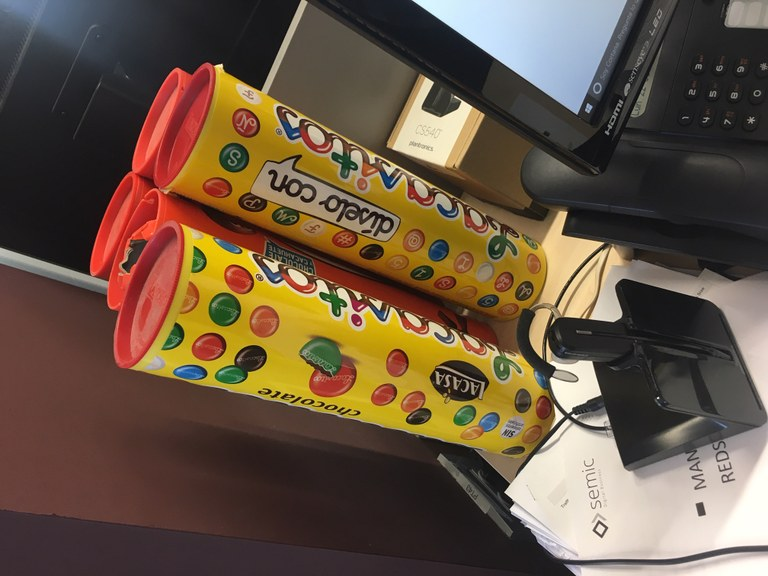

## Challenge 2
In SEMIC we have some weakness. One of them is to collect *Lacasitos*
and *Conguitos* tubes.



Each tube weight is 1.5 Kg and contains aproximately 1500 Lacasitos.
One of our passtime is separate them by colours and stack them by
all the possible ways.

For example, if we have 5 lacasitos, there are 7 ways of stack them.

```
O   O   O   O   O
OO   O   O   O
OOO   O   O
OOO   OO
OO   OO   O
OOOO   O
OOOOO
```

By the time we have collocted 6666 tubes of lacasitos of 1.5Kg,
that sum up to a total of 10.000.000 Lacasitos.

**How many ways of stack up do we have?**

Pos the solution in the following format:

```
Case #10000000: <result>
```
