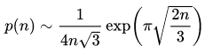

The solution for this challenge was a bit... Foolish.

After a long search and a lot of confussion (mind that we were told that
we had to write an algorithm to solve the problem) we found out that this
is a very well known problem called **Partition (number theory)**.

From [wikipedia](https://en.wikipedia.org/wiki/Partition_(number_theory)) we
discovered that, for example *p(10000)* is approximately 3.6\*10^106.

Remember that we are looking for *p(10000000)* so the solution for that
gotta be a really big number. 

After that discover we had to possibilies:

* We can write an algorithm with big numbers to calculate that

* We can find a way of aproximating it

First we thought about implementing the first option but after a bit of
workarround and finding the formula of calculating the number (in wikipedia)
we observed that probably the joke of the problem was in realizing that is
very dificult to calculate so you have to somehow aproximate it.

What brings us to our next idea, aproximating it, after looking a bit in 
the wikipedia you can find that for aproximating *p(10000000)* we have 
the following formula:
  


Dont go that fast! Aproximating is fine but you will need tools for calculating
that, during the CTF we used [hypercalc](https://mrob.com/pub/perl/hypercalc.html)
a calculator that doesnt overflow. 

Finally putting all together in the calculator:
```
In[2] := (1/(4*10000000*sqrt(3)))*exp(pi*sqrt((2*10000000)/3))
Out[2] = 9.2040077089 × 10^3514
```

And yes, it is a really big number.
Official result submision:
```
Case #10000000: 9.2040077089*10^3514
```
