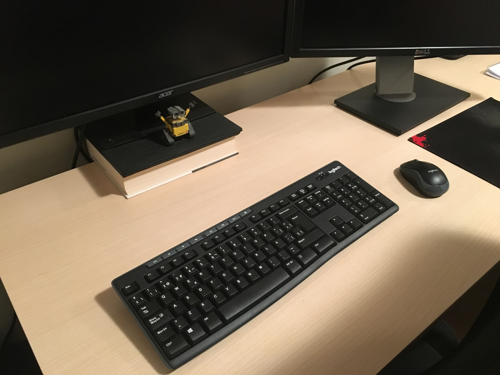

## Challenge 4

In SEMIC we take serious our computer security. So much that one of our
mates is in charge just for unlocking with a master password all of our
services and server. Its unic TODO in semic is to enter his room, write
the password one time and another. All days in a specific room with an 
specific computer for that finality. Also he is the only one that knows
the password and he has the password in his mind. He does the same from 
1995 that is when this securiy measure was implemented in the company.

The problem is that our mate disapeered and we dont have way to contact
him. All the company is stoped and noone can work. We must find that 
password!



We also entered his room to search for all possible clues that help us
to decrypt the key, but we didnt find anything.

After an urgency meeting and various hours of investigation, we found
a database that contains the password. Sadly (or luckly) its a hash.

This is the key we found
```
b8e46064c5cb98321ab378f546d2641881b43563
```
If you find the key, send it with the following format:
```
Case #1: <key>
```

If you coded some tool for decrypting it, we would like to have it for
a future.
                                                                    
~    
