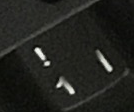

## Solution

Solution for this was tricky. A general idea for solving this was clear
from the begining.

First your are told that the securty is implemented in the year 1975 so
you can find out that the hash is probably SHA1.

Another thing that is clear is that if the guy comes and write the pass
in the same compute with the same keyboard, probably the keys are somehow
noticeable so:

We can get a possible charset and bruteforce the password trying combinations
and comparing to the has given.

So pretty easy, right?

Well we had a lot of problems finding out the keys that are like probably
in the password. 

But, if you look closely you can notice some, here there is an example.



Its not that easy, you can also use image processing tools to generate 
contrast and find out.
The final charset we found is
```
 's','f','g','c','m','S','F','G','C','M','1','3','5','0','!','%','='
```

So we wrote a trivial python program to bruteforce the hash trying all
combinations with the charset, hashing, and comparing to the original hash
until we get the correct password (after like 1 hour)

You can find the original spagetty algorithm at: solve.py

And get the password...:
```
s3m1c%0fG
```

Also I wrote an improved C version with parallelization for running into 
cluster and getting a faster solution. (solve.c)
The C solution needs a lot of optimization. With the time it will get optimized.
